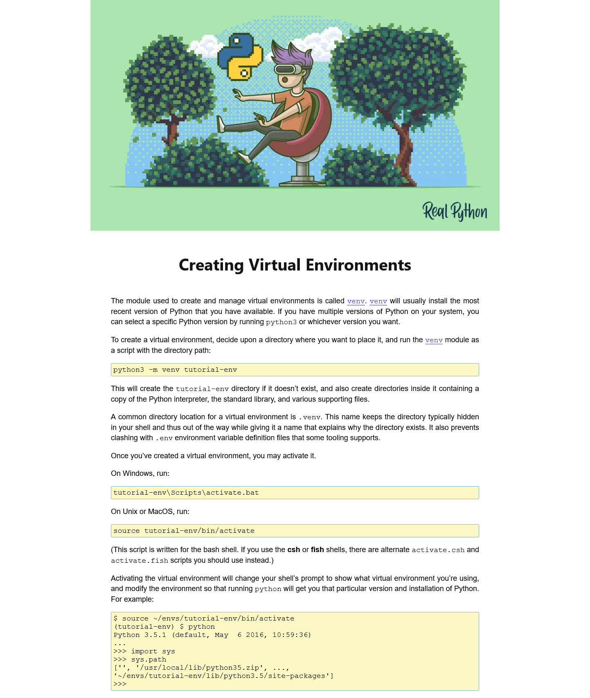

# CP1520 — Test 2

Build the website shown below using the files in `starter_files.zip`:
- `test2_start.html`
- `page_text`
- `venv.png`

Zip and submit your work to the Test 2 dropbox by **10:30am**.

## Completed Page

## Variables and Colors (1 mark)

- Store all colors as variables in the `:root` pseudo-class in your external style sheet.
  - accent color --> light blue
  - link color --> rgb(53, 53, 221)
  - code background color --> rgb(253, 248, 196)

## Code Blocks  (1 mark)

- Code that the reader is expected to type should be wrapped in `<pre></pre>` tags
  - See test2_start.html for an example.

## In-line elements (2 marks)

- Names of files, directories, file extensions, and executables in the document text are wrapped in `<code></code>` elements. 
- The names of the shells `csh` and `fish` should be bolded using an HTML element.

## General (2 marks)

- The document has a maximum width of 1000px;
- The body of the document is centered on the page.
- Put your name in the `<title>`

## Image (1 mark)

- Image is given a width of the full screen size

## Text (3 marks)
- There should be a base `font-size` of `10px` set on the entire document.
- `<h1>`
  - sized at 4 * base font size
  - text is centered
  - font family is Segoe UI, using Tahoma, and sans-serif as fallback.
- `
` 
  - is sized at 1.8 * base font size
  - line-height is set at 2.5 * the base font size
  - text is justified
  - font family is Arial, using Helvetical, and san-serif as fallbacks.
- `<pre>`
  - same font-size as `
`
  - padding on all sides of 5px
  - 1px border using the accent color
  - use background color defined in `:root` 
- `<a>`
  - use variable link color defined in `:root`
  - use this link for the `venv` links in the first and second paragraphs: https://docs.python.org/3/library/venv.html#module-venv